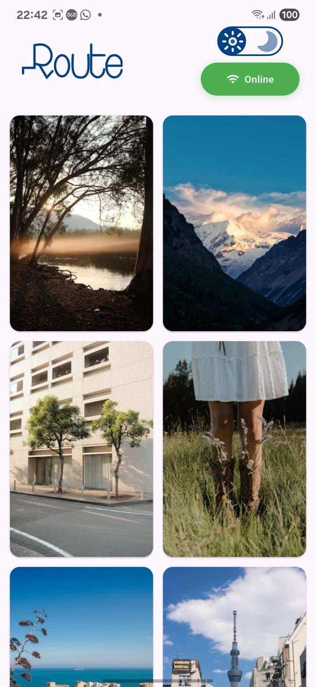
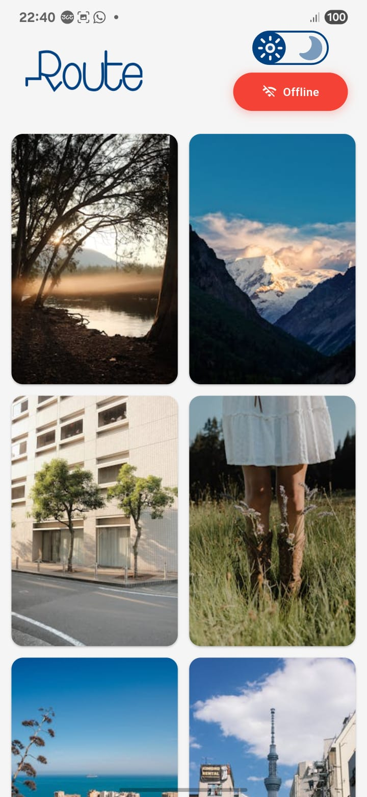
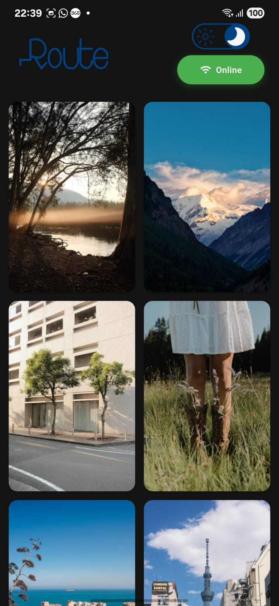
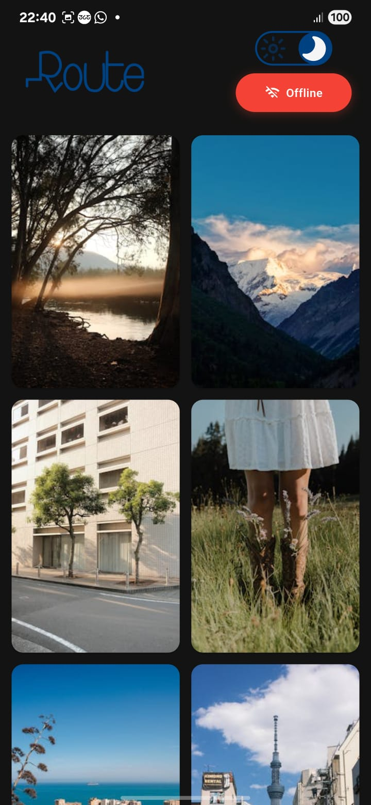
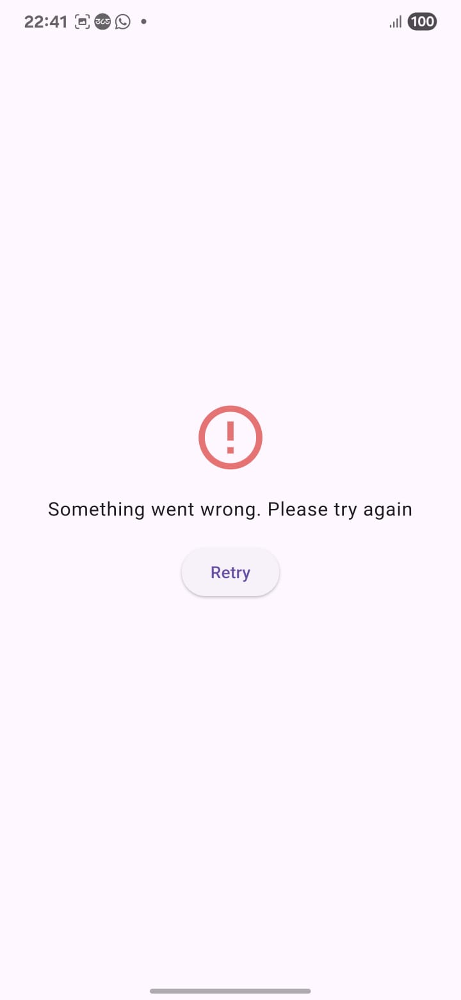

# selfdep

# 📸 Pinterest-Style Flutter Photo Gallery App

A clean, scalable, and responsive Flutter application inspired by **Pinterest**, 
built using modern architecture practices. It fetches high-resolution photos from [Pexels.com](https://www.pexels.com) via `Retrofit + Dio`, manages state using `Cubit`, and caches data locally with `Hive`.

---

## 🚀 Features

✅ Beautiful, responsive photo grid layout using `SliverMasonryGridView`  
✅ Fetches real-time photo data from Pexels via `Retrofit + Dio`  
✅ Robust **offline support** via `Hive` local storage  
✅ **Connectivity-aware UI** using `connectivity_plus`  
✅ Animated widget to reflect online/offline status  
✅ Light & Dark **theme switching** via custom toggle  
✅ **State management** using `Cubit` (from `flutter_bloc`)  
✅ Follows **Clean Architecture**: Domain, Usecases, Entities  
✅ **Dependency injection** using `injectable` & `get_it`  
✅ Thoughtful error handling from Dio with clean fallback UIs  
✅ Highly modular, testable, and easy to extend  
✅ **Cached network images** for better performance  
✅ **Shimmer loading effects** for smooth user experience  
✅ **Cross-platform support** (iOS, Android, Web, Desktop)

---

## 🧠 Architecture

This app follows **Clean Architecture**:

```
lib/
├── core/                           # Shared logic, utilities, and widgets
│   ├── cache/                      # Custom cache manager
│   ├── di/                         # Dependency injection setup
│   ├── network/                    # API configuration and error handling
│   ├── theme/                      # Theme management with Cubit
│   └── widgets/                    # Reusable UI components
├── features/
│   └── home/
│       ├── data/                   # Data sources, models, mappers
│       │   ├── remote/             # Retrofit API clients
│       │   ├── local/              # Hive integration
│       │   └── repository/         # Repository implementation
│       ├── domain/                 # Entities and usecases
│       │   ├── entities/           # Domain models
│       │   ├── repository/         # Repository contracts
│       │   └── usecases/           # Business logic
│       └── presentation/
│           ├── cubit/              # State management with Cubit
│           ├── screen/             # Screens (UI)
│           └── widgets/            # Feature-specific widgets
├── theme/                          # App theme definitions
└── main.dart                       # App entry point
```

---

## 📦 Tech Stack

| Concern            | Package                          |
|--------------------|----------------------------------|
| API Requests       | [`retrofit`](https://pub.dev/packages/retrofit) + [`dio`](https://pub.dev/packages/dio) |
| State Management   | [`flutter_bloc`](https://pub.dev/packages/flutter_bloc) with **Cubit** |
| Local Storage      | [`hive`](https://pub.dev/packages/hive), [`hive_flutter`](https://pub.dev/packages/hive_flutter) |
| Layout             | [`flutter_staggered_grid_view`](https://pub.dev/packages/flutter_staggered_grid_view) |
| Connectivity       | [`connectivity_plus`](https://pub.dev/packages/connectivity_plus) |
| Image Caching      | [`cached_network_image`](https://pub.dev/packages/cached_network_image) |
| Loading Effects    | [`shimmer`](https://pub.dev/packages/shimmer) |
| Theming            | Custom dark/light themes with animated toggle |
| Dependency Injection | [`injectable`](https://pub.dev/packages/injectable) + [`get_it`](https://pub.dev/packages/get_it) |
| Equality & Models  | [`equatable`](https://pub.dev/packages/equatable), [`json_serializable`](https://pub.dev/packages/json_serializable) |
| Logging            | [`logger`](https://pub.dev/packages/logger), [`pretty_dio_logger`](https://pub.dev/packages/pretty_dio_logger) |
| UI Components      | [`animated_toggle_switch`](https://pub.dev/packages/animated_toggle_switch), [`flutter_svg`](https://pub.dev/packages/flutter_svg) |

---

## 🧪 Getting Started

### 🔧 Requirements

- Flutter SDK (3.8.1+)
- Dart 3.x
- A valid [Pexels API Key](https://www.pexels.com/api/)

---

## 🔧 Dependency Injection Strategy

### Why Manual GetIt Over Injectable?

This project uses **manual dependency registration** with `GetIt` instead of the `injectable` package for several strategic reasons:

#### 🎯 **Technical Challenges**
- **Build Runner Issues**: `injectable` requires `build_runner` for code generation, which failed multiple times during development
- **Complex Initialization**: Hive setup with type adapters requires specific initialization order that's easier to control manually
- **Async Dependencies**: Custom `DioClient` configuration and Hive initialization need careful sequencing

#### ✅ **Benefits of Manual Approach**

| Aspect | Manual GetIt | Injectable |
|--------|-------------|------------|
| **Build Reliability** | ✅ No code generation | ❌ Depends on build_runner |
| **Initialization Control** | ✅ Full control over order | ❌ Limited flexibility |
| **Debugging** | ✅ Clear registration flow | ❌ Generated code complexity |
| **Setup Complexity** | ✅ Straightforward | ❌ Requires annotations + generation |
| **Hive Integration** | ✅ Easy async setup | ❌ Requires workarounds |

#### 🏗️ **Our Implementation**

```dart
Future<void> initializeDependencies() async {
  // 1. Initialize Hive with proper sequencing
  await Hive.initFlutter();
  Hive.registerAdapter(PhotoHiveModelAdapter());
  Hive.registerAdapter(PhotoSrcHiveModelAdapter());

  // 2. Configure network layer
  final dioClient = DioClient();
  sl.registerLazySingleton<Dio>(() => dioClient.dio);

  // 3. Register data sources with explicit dependencies
  sl.registerLazySingleton<PhotoRemoteDataSource>(
    () => PhotoRemoteDataSourceImpl(sl()),
  );

  // 4. Clean dependency chain
  sl.registerFactory(() => PhotoCubit(getCuratedPhotos: sl()));
}
```

#### 🚀 **Why This Works Better**

- **No Build Failures**: Eliminates `build_runner` dependency issues
- **Explicit Dependencies**: Clear visibility of what depends on what
- **Easy Testing**: Simple to mock dependencies without generated code
- **Maintainable**: Easy to modify registration logic
- **Performance**: No reflection or code generation overhead

This approach provides the same dependency injection benefits as `injectable` while maintaining full control over the initialization process and avoiding build-time complications.

---

### 🛠️ Setup Instructions

1. **Clone the repository**

```bash
git clone https://github.com/AbdelrahmanGharib11/route_task.git
cd route_task
```

2. **Install dependencies**

```bash
flutter pub get
```

3. **Generate required files**

```bash
dart run build_runner build --delete-conflicting-outputs
```

4. **Add your Pexels API Key**

Create a file `lib/core/constants/api_constants.dart` and add:

```dart
class ApiConstants {
  static const String pexelsApiKey = 'YOUR_PEXELS_API_KEY_HERE';
  static const String baseUrl = 'https://api.pexels.com/v1/';
}
```

5. **Run the app**

```bash
flutter run
```

---

## 📱 Features in Detail

### 💾 Offline Support

- All fetched photos are automatically saved in a **Hive** local database
- Previously viewed photos remain accessible even when offline
- Seamless navigation without re-fetching data
- Smart caching strategy to optimize storage usage

### 📡 Connectivity Handling

- Real-time network status detection using `connectivity_plus`
- Animated connectivity indicator showing online/offline status
- Graceful fallback to cached data when offline
- Automatic data sync when connection is restored

### 🎨 Theme Switching

- Beautiful animated toggle switch for theme selection
- Smooth transitions between light and dark modes
- Theme preference persisted using `SharedPreferences`
- Consistent theming across all UI components
- Custom color schemes optimized for both themes

### 🖼️ Photo Gallery

- Pinterest-style masonry grid layout
- High-resolution images from Pexels API
- Lazy loading with shimmer effects
- Optimized image caching for performance
- Responsive design adapting to different screen sizes

### 🏗️ State Management

- **Cubit** pattern for predictable state management
- Separation of concerns with clean state classes
- Reactive UI updates based on state changes
- Error handling with user-friendly messages

---

## 🔧 Configuration

### API Configuration

The app uses Dio with custom interceptors for:
- Request/response logging
- Error handling
- Authentication headers
- Timeout configuration

### Cache Configuration

Custom cache manager with:
- Configurable cache duration
- Automatic cache cleanup
- Memory and disk caching strategies

### Theme Configuration

Two predefined themes:
- **Light Theme**: Clean white background with blue accents
- **Dark Theme**: Dark background with consistent color scheme

---

## 🧪 Testing

Run tests with:

```bash
flutter test
```

### Test Coverage

- Unit tests for State Managements
- Integration tests for complete user flows

---

## 📂 Project Structure Details

### Core Module
- **DI**: Dependency injection setup using `injectable`
- **Network**: API client configuration and error handling
- **Theme**: Theme management with persistence
- **Widgets**: Reusable UI components

### Home Feature
- **Data Layer**: API clients, local storage, and repositories
- **Domain Layer**: Business entities and use cases
- **Presentation Layer**: UI screens and state management

---

## 🚀 Build & Deployment

### Android
```bash
flutter build apk --release
```

### iOS
```bash
flutter build ios --release
```

### Web
```bash
flutter build web --release
```

### Desktop
```bash
flutter build windows --release
flutter build macos --release
flutter build linux --release
```

---

## 🤝 Contributing

1. Fork the repository
2. Create a feature branch (`git checkout -b feature/amazing-feature`)
3. Commit your changes (`git commit -m 'Add amazing feature'`)
4. Push to the branch (`git push origin feature/amazing-feature`)
5. Open a Pull Request

---

## 📄 License

This project is licensed under the MIT License - see the [LICENSE](LICENSE) file for details.

---

## 👨‍💻 Author

**Abdelrahman Gharib**
- GitHub: [@AbdelrahmanGharib11](https://github.com/AbdelrahmanGharib11)
- LinkedIn: [Abdelrahman Gharib](https://www.linkedin.com/in/abdelrahman-ghareeb-b0777a278)

- Gmail: [@AbdelrahmanGharib11](abdelrahmanghareeb2003@gmail.com)

---

## 🙏 Acknowledgments

- [Pexels](https://www.pexels.com) for providing beautiful, free photos
- Flutter team for the amazing framework
- All the package maintainers for their excellent work

---

## 📸 Screenshots

### Light Mode




### Dark Mode




### Offline Mode


### Loading Mode


### Error Mode

---

*Built with ❤️ using Flutter*
